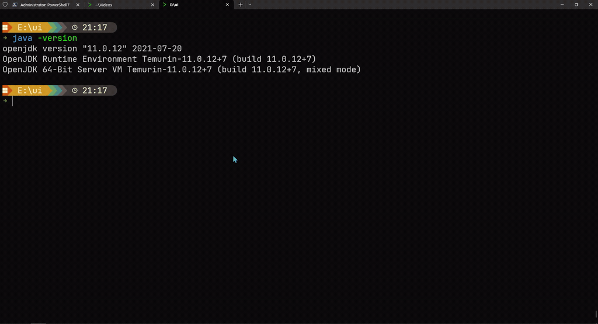

<div align="center">


# Jenv: Java Environment Manager


</div>

## Recent Updates (v0.6.7)

### 🚀 Performance Improvements
- **Ultra-fast JDK scanning**: Reduced scanning time from 3 seconds to 300ms (90% improvement)
- **Concurrent processing**: Implemented Dispatcher-Worker model with goroutines
- **Smart filtering**: Aggressive pre-filtering to skip unnecessary directories
- **Progress tracking**: Real-time scanning progress and detailed statistics

### ✅ Cross-Platform Support
- **Linux support completed**: Full Linux compatibility with multi-shell support
- **Windows optimization**: Enhanced path validation and compatibility fixes
- **macOS preparation**: Infrastructure ready for macOS support (coming soon)

### 🔧 Technical Enhancements
- **Java path validation**: Improved Windows JDK detection reliability
- **Environment management**: Optimized cross-platform environment variable handling
- **Configuration cleanup**: Removed unused options and improved code maintainability

---

## Overview

`Jenv` is a command-line tool for managing multiple Java versions on your system. It allows you to easily switch between
different Java versions, add new Java installations, and manage your Java environment.

## Features

### Efficient Java Version Management

- **Symlink-Based Architecture**
    - Fast version switching through symbolic links
    - One-time system PATH configuration
    - Changes persist across system reboots
    - Instant effect in all console windows

### Cross-Platform Support

- **Windows Support**
    - Registry-based environment variable management (Windows standard)
    - Automatic administrator privilege handling
    - Minimized UAC prompts with least privilege principle
    - Superior performance on Windows 10/11 systems

- **Linux/Unix Support**
    - Shell configuration file-based environment management
    - User-level and system-level configuration options
    - Multi-shell environment support (bash, zsh, fish)
    - Intelligent permission handling

### Modern CLI Experience

- **User-Friendly Interface**
    - Intuitive command structure
    - Light/Dark theme support
    - Colorful output for improved readability
    - Detailed help documentation

### Advanced Features

- **Smart JDK Management**
    - System-wide JDK scanning
    - **Ultra-fast scanning performance (3s → 300ms)** using concurrent Dispatcher-Worker model
    - Alias-based JDK management
    - Current JDK status tracking
    - Easy JDK addition and removal
    - Detailed scanning statistics and progress display

### Future-Ready

- **Cross-Platform Support**
    - Windows support (✅ Complete)
    - Linux support (✅ Complete)
    - macOS support (🚧 In Progress)
## Project Structure

```
.
├── src/                # Source code directory
│   ├── cmd/            # Command implementations
│   │   ├── add.go      # Add JDK command
│   │   ├── list.go     # List JDKs command
│   │   ├── remove.go   # Remove JDK command
│   │   ├── use.go      # Switch JDK command
│   │   └── root.go     # Root command and flags
│   ├── internal/       # Internal packages
│   │   ├── config/     # Configuration management
│   │   ├── constants/  # Constants definitions
│   │   ├── env/        # Environment handling
│   │   ├── java/       # Java SDK management
│   │   ├── logging/    # Logging utilities
│   │   ├── style/      # UI styling
│   │   └── sys/        # System utilities
│   └── jenv.go         # Main entry point
├── doc/                # Documentation
└── .github/            # GitHub configurations
    └── workflows/      # CI/CD workflows
```

## Installation

### From Release
Download the latest release from the [Releases page](https://github.com/WhyWhatHow/jenv/releases).

### Build from Source

#### Prerequisites

- Go 1.21 or higher
- Git
- **Windows**: Administrator privileges required for system symbolic links
- **Linux**: Root privileges recommended for system-wide installation (optional)

#### Build Steps

1. Clone the repository:
```bash
git clone https://github.com/WhyWhatHow/jenv.git
cd jenv
```

2. Build the project:

```bash
cd src

# For Windows (PowerShell)
go build -ldflags "-X github.com/whywhathow/jenv/cmd.Version=1.0.0" -o jenv.exe

# For Linux/macOS
go build -ldflags "-X github.com/whywhathow/jenv/cmd.Version=1.0.0" -o jenv

# For development build (with debug information)
go build -o jenv
```

## Usage


### Installation Verification

```bash
# Verify jenv installation
jenv --version
```

### First-time Setup

```bash
# Initialize jenv (required for first-time use)
jenv init

# Add jenv to your system PATH
jenv add-to-path
```

**Note for Linux users**: After initialization, you may need to restart your shell or run:
```bash
# For bash users
source ~/.bashrc

# For zsh users
source ~/.zshrc

# For fish users
source ~/.config/fish/config.fish
```

### Add and remove JDK



```bash
# Add a new JDK with an alias name
#jenv add <alias> <jdk_path>
jenv add jdk8 "C:\Program Files\Java\jdk1.8.0_291"
#jenv remove <alias>
jenv remove jdk8
```

### List all installed JDKs

```bash
jenv list
```

### Switch to a specific JDK version

```bash
#jenv use <alias>
jenv use jdk8
```

### Remove a JDK from jenv

```bash
#jenv remove <alias>
jenv remove jdk8
```

### Show current JDK in use

```bash
jenv current
```

### Scan system for installed JDKs
```bash
# Windows
jenv scan c:\

# Linux
jenv scan /usr/lib/jvm
jenv scan /opt

# macOS
jenv scan /Library/Java/JavaVirtualMachines

# Performance: Ultra-fast scanning with concurrent processing
# 🚀 Optimized from 3 seconds to 300ms using Dispatcher-Worker model
```

### Add jenv to system PATH

```bash
jenv add-to-path
```

### Change UI theme (light/dark)

```bash
#jenv theme <theme_name>
jenv theme dark
```

### help & version
```bash
#jenv help [command]
jenv --version
```

## Q&A

### Why are administrator privileges needed?

**Windows**: Due to Windows system restrictions, creating system-level symbolic links requires running PowerShell as Administrator.

**Linux**: Administrator privileges (sudo/root) are only required for:
- System-wide installation (symlinks in `/opt/jenv/`)
- Modifying system-level environment files (`/etc/environment`)

Without root privileges, jenv will automatically use user-level configuration in your home directory.

### Why was this project created?

While Linux and macOS users have mature tools like `sdkman` and `jenv` for Java version management, Windows users have
limited options. The existing [Jenv-forWindows](https://github.com/FelixSelter/JEnv-for-Windows) solution, while
functional, faces performance issues on Windows 10 systems.

This project was born out of two motivations:

1. To create a fast, efficient Java version manager specifically optimized for Windows
2. To explore AI-assisted development using tools like `cursor` and `Trae` while learning Go programming from scratch

The goal is to provide Windows developers with a robust, performant solution for managing multiple Java environments,
similar to what Linux and macOS users already enjoy.

### How it works?

Inspired by nvm-windows, JEnv uses symlinks for Java version management across all platforms, which offers several advantages:

1. **Symlink-Based Architecture**
    - **Windows**: Creates a single symlink at `C:\java\JAVA_HOME` during installation
    - **Linux**: Creates symlink at `/opt/jenv/java_home` (system) or `~/.jenv/java_home` (user)
    - Switching Java versions only requires updating the symlink target
    - No need to modify system PATH repeatedly
    - Changes persist across system reboots and apply to all console windows/shells

2. **High-Performance Implementation**
    - **Ultra-fast JDK scanning**: Optimized from 3 seconds to 300ms using concurrent processing
    - **Dispatcher-Worker Model**: Parallel JDK detection with worker goroutines
    - **Intelligent Pre-filtering**: Aggressive directory filtering to skip unnecessary locations
    - **Detailed Statistics**: Real-time progress tracking and comprehensive scan results
    - **Optimized Path Exclusion**: Smart logic to avoid scanning duplicate or invalid paths

3. **Implementation Details**
    - During initialization:
        - **Windows**: Creates `JAVA_HOME` directory at `C:\java\JAVA_HOME`
        - **Linux**: Creates symlink directory based on privileges (system or user level)
        - Adds `JAVA_HOME/bin` to system PATH (one-time setup)
        - Creates initial symlink to default JDK
    - When switching versions:
        - Simply updates symlink target to desired JDK
        - No PATH modifications needed
        - Changes take effect immediately in all console windows/shells

4. **Permission Handling**
    - **Windows**: Administrator privileges required for system symbolic links
    - **Linux**: Root privileges optional - falls back to user-level configuration
    - UAC/sudo prompts handled automatically with minimal privilege scope
    - Follows the principle of least privilege
    - Permission requests only occur during initialization and version switching

5. **Multi-Shell Support (Linux)**
    - Automatically detects and configures bash, zsh, fish shells
    - Updates appropriate configuration files (.bashrc, .zshrc, config.fish)
    - Ensures environment variables persist across shell sessions

This approach is more efficient than constantly modifying system PATH variables, providing a cleaner and more reliable
solution for Java version management across all supported platforms.

## Acknowledgments

- [cobra](https://github.com/spf13/cobra) - A powerful CLI framework for Go
- [jreleaser](https://jreleaser.org/) - A release automation tool
- [nvm-windows](https://github.com/coreybutler/nvm-windows) - Inspired our symlink-based approach
- [Jenv-for-Windows](https://github.com/FelixSelter/JEnv-for-Windows) - A predecessor project for Java version
  management on Windows

## License

This project is licensed under the Apache License 2.0 - see the [LICENSE](LICENSE) file for details.

