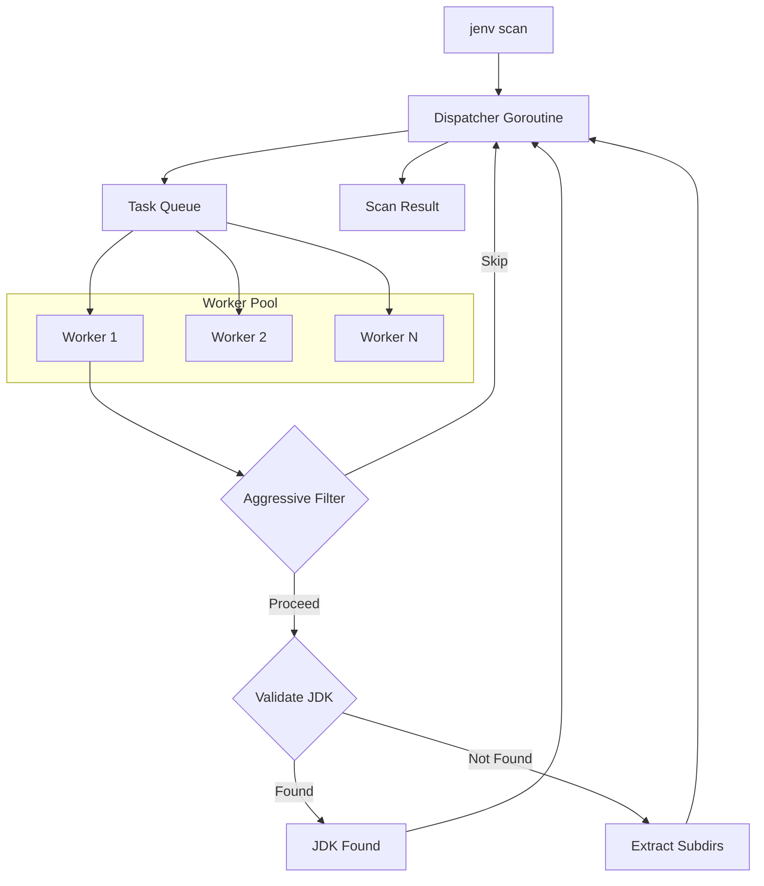
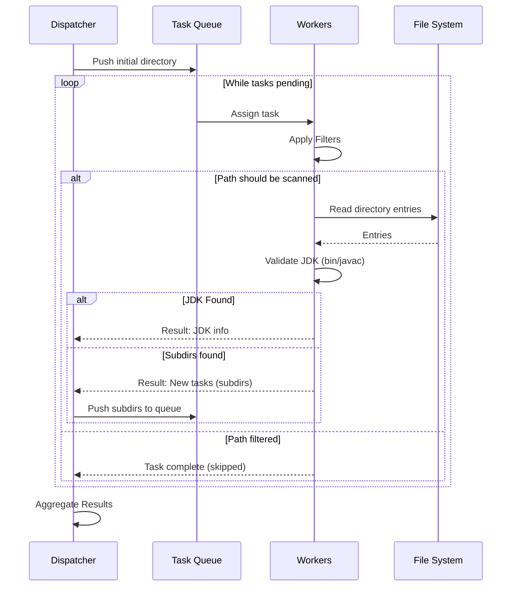

# High-Performance JDK Scanning in JEnv

English | [中文](PERFORMANCE_zh.md) | [日本語](PERFORMANCE_jp.md)

One of the standout features of JEnv is its ultra-fast JDK scanning capability. While traditional tools might take several seconds to traverse your file system looking for Java installations, JEnv typically completes this task in **under 300ms**—a 10x improvement over conventional methods.

This document explains the technical architecture and optimizations that make this possible.

## The Challenge

Scanning a large disk (like `C:\` on Windows or `/` on Linux) for JDK installations is IO-intensive. A naive recursive search:
1.  Visits every single directory.
2.  Checks for the existence of `javac` or other JDK markers.
3.  Operates sequentially, meaning it's blocked by disk latency at every step.

On a typical developer machine with hundreds of thousands of files, this can easily take 3-5 seconds or more.

## Architecture Overview

JEnv uses a multi-layered approach to maximize performance, combining concurrent processing with intelligent search space reduction.

## The Solution: Dispatcher-Worker Model

JEnv employs a sophisticated **Dispatcher-Worker** model implemented using Go's lightweight goroutines and channels.

### 1. Concurrent Processing
Instead of scanning one directory at a time, JEnv spawns a pool of worker goroutines (typically `runtime.NumCPU() * 2`).

- **Dispatcher**: Manages a queue of directories to be scanned. It feeds tasks to workers and collects results. It maintains state and decides when the scan is complete.
- **Workers**: Pick up a directory path, perform filtering and validation, and if subdirectories need scanning, they are passed back to the dispatcher.

### 2. Scanning Sequence

The interaction between components follows a highly parallelized pattern:

### 3. Aggressive Pre-Filtering
The fastest way to scan a directory is to not scan it at all. JEnv uses a built-in "blacklist" of directories that are known *never* to contain JDKs.

Before a worker even opens a directory, it checks its name against patterns like:
- **System Folders**: `Windows`, `System32`, `$Recycle.Bin`, `/proc`, `/dev`.
- **Package Managers**: `node_modules`, `.m2`, `gradle`, `pip`, `anaconda`.
- **IDE/Build Artifacts**: `.git`, `.idea`, `.vscode`, `target`, `build`, `dist`.
- **User Content**: `Downloads`, `Documents`, `Pictures`, `Videos`.

By skipping these massive directory trees, JEnv avoids millions of unnecessary syscalls.

### 4. Smart Depth Limiting
JDKs are rarely buried 20 levels deep. JEnv uses an intelligent depth-limiting strategy (typically capped at 5 levels from the search root) to prevent the scanner from "getting lost" in deep application data folders, while still finding JDKs in standard locations.

### 5. Optimized Path Validation
JEnv doesn't just look for any file; it specifically validates the structure of a JDK (checking for `bin/javac`). This validation is highly optimized to minimize disk hits.

## Performance Benchmark

| Method | Time (Typical) | Improvement |
| :--- | :--- | :--- |
| Naive Recursive Scan | ~3,000ms | Baseline |
| **JEnv (Concurrent + Filtered)** | **<300ms** | **90% Faster** |

## Summary

By combining Go's powerful concurrency primitives with domain-specific knowledge about where JDKs are (and aren't) located, JEnv provides a near-instant experience for managing your Java environments.

---

*Explore the implementation in [`src/internal/java/sdk.go`](../src/internal/java/sdk.go).*
