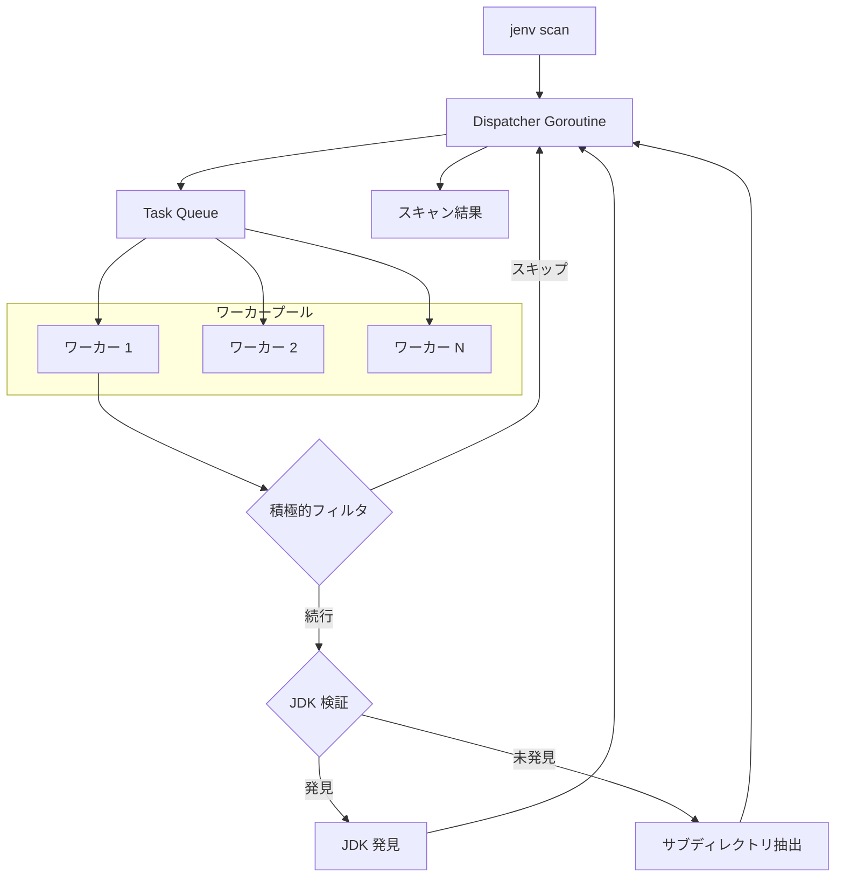
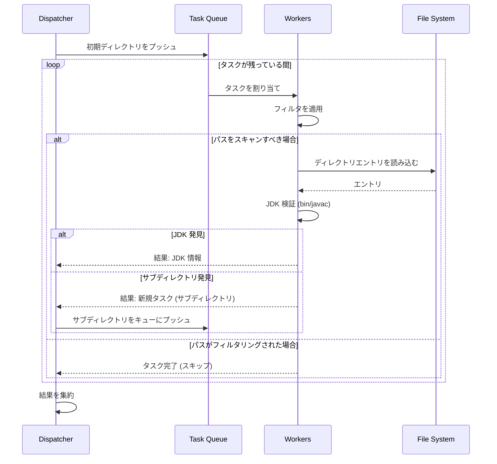

# JEnv における高性能 JDK スキャン

[English](PERFORMANCE.md) | [中文](PERFORMANCE_zh.md) | 日本語

JEnv の際立った機能の 1 つは、その超高速な JDK スキャン機能です。従来のツールでは Java インストールを探すためにファイルシステムのトラバースに数秒かかることがありますが、JEnv は通常、このタスクを **300ms 未満**で完了します。これは従来のプロセスと比較して 10 倍の向上です。

このドキュメントでは、これを可能にしている技術的なアーキテクチャと最適化について説明します。

## 課題

JDK インストールを求めて大きなディスク（Windows の `C:\` や Linux の `/` など）をスキャンすることは、I/O 負荷の高い作业です。ナイーブな再帰的検索では以下の問題が発生します：
1.  すべてのディレクトリを訪問する。
2.  `javac` やその他の JDK マーカーの存在を確認する。
3.  逐次的に動作するため、各ステップでディスクレイテンシによってブロックされる。

数十万のファイルがある一般的な開発者のマシンでは、これに 3〜5 秒、あるいはそれ以上かかることが容易にあります。

## アーキテクチャの概要

JEnv は、並列処理とインテリジェントな検索空間の削減を組み合わせることで、パフォーマンスを最大化する多層的なアプローチを採用しています。

## 解決策：Dispatcher-Worker モデル

JEnv は、Go の軽量な goroutine とチャネルを使用して実装された高度な **Dispatcher-Worker** モデルを採用しています。

### 1. 並列処理
ディレクトリを 1 つずつスキャンする代わりに、JEnv はワーカー goroutine のプール（通常は `runtime.NumCPU() * 2`）を生成します。

- **Dispatcher（ディスパッチャー）**: スキャンするディレクトリのキューを管理します。ワーカーにタスクを供給し、結果を収集します。スキャン全体の状態を維持し、完了を判断します。
- **Worker（ワーカー）**: ディレクトリパスを取得し、フィルタリングと検証を行います。さらにスキャンが必要なサブディレクトリがある場合は、ディスパッチャーに返します。

### 2. スキャンシーケンス

コンポーネント間の相互作用は、高度に並列化されたパターンに従います：

### 3. 積極的なプリフィルタリング
ディレクトリをスキャンする最速の方法は、スキャンしないことです。JEnv は、JDK が含まれていないことがわかっているディレクトリの「ブラックリスト」を組み込んでいます。

ワーカーがディレクトリを開く前に、その名前を以下のパターンと照合します：
- **システムフォルダ**: `Windows`, `System32`, `$Recycle.Bin`, `/proc`, `/dev` など。
- **パッケージマネージャー**: `node_modules`, `.m2`, `gradle`, `pip`, `anaconda` など。
- **IDE/ビルドアーティファクト**: `.git`, `.idea`, `.vscode`, `target`, `build`, `dist` など。
- **ユーザーコンテンツ**: `Downloads`, `Documents`, `Pictures`, `Videos` など。

これらの巨大なディレクトリツリーをスキップすることで、JEnv は何百万もの不要な系统コールを回避します。

### 4. スマートな深度制限
JDK が 20 レベルも深い場所に配置されることは稀です。JEnv はインテリジェントな深度制限戦略（通常、検索ルートから 5 レベルに制限）を使用して、スキャナーが深いアプリケーションデータフォルダで「迷子」になるのを防ぎつつ、標準的な場所にある JDK を確実に見つけます。

### 5. 最適化されたパス検証
JEnv は単にファイルを探すだけではありません。JDK の構造を具体的に検証します（`bin/javac` の存在確認など）。この検証は、ディスクへのアクセスを最小限に抑えるよう高度に最適化されています。

## パフォーマンスベンチマーク

| 手法 | 時間（一般的） | 向上率 |
| :--- | :--- | :--- |
| ナイーブな再帰スキャン | ~3,000ms | 基準 |
| **JEnv（並列 + フィルタリング）** | **<300ms** | **90% 高速** |

## まとめ

Go の強力な並列処理プリミティブと、JDK がどこに存在し（どこに存在しないか）に関するドメイン固有の知識を組み合わせることで、JEnv は Java 環境を管理するためのほぼ瞬時の体験を提供します。

---

*実装の詳細については [`src/internal/java/sdk.go`](../src/internal/java/sdk.go) をご覧ください。*
