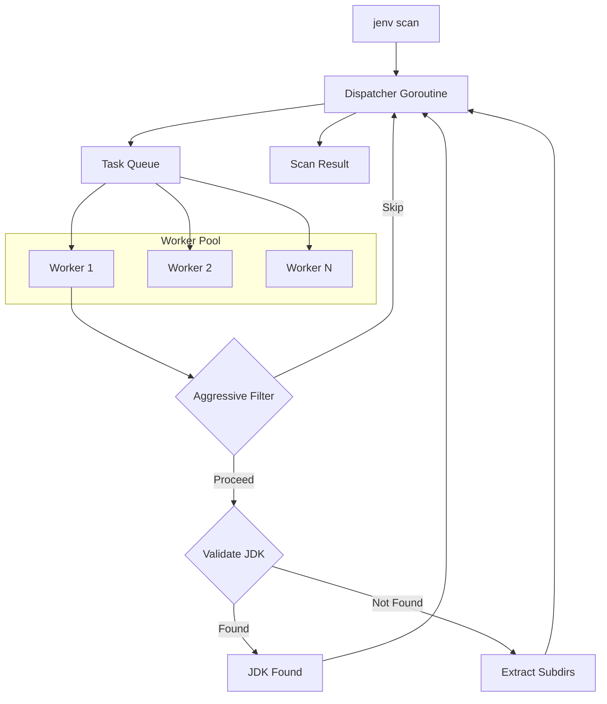
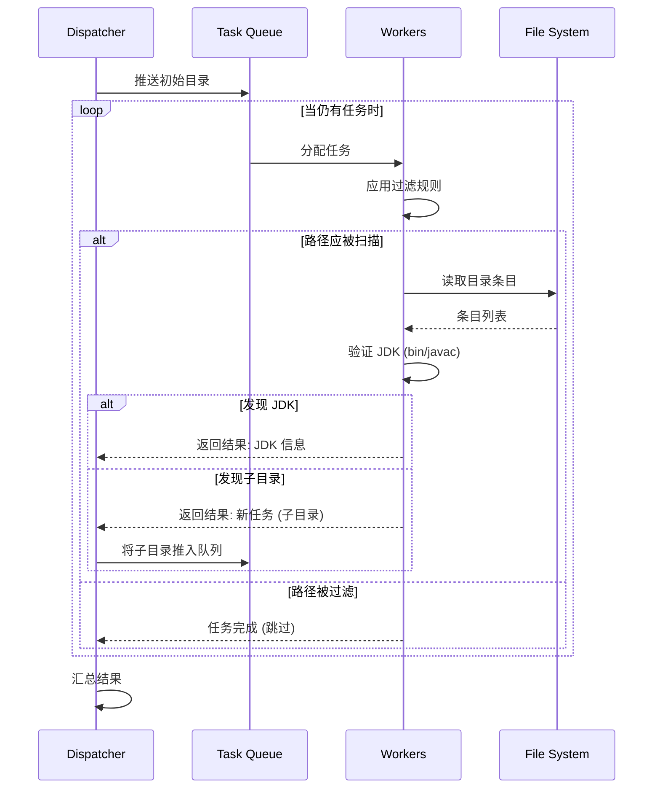

# JEnv 高性能 JDK 扫描机制

[English](PERFORMANCE.md) | [日本語](PERFORMANCE_jp.md) | 中文

JEnv 的核心亮点之一是其极速的 JDK 扫描能力。传统工具在遍历文件系统寻找 Java 安装路径时可能需要几秒钟，而 JEnv 通常在 **300 毫秒内** 即可完成——比常规方法快了 10 倍。

本文将详细介绍实现这一性能的技术架构和优化策略。

## 挑战

在大型磁盘（如 Windows 的 `C:\` 或 Linux 的 `/`）中扫描 JDK 是一个 IO 密集型任务。传统的递归搜索存在以下问题：
1.  访问每一个目录。
2.  检查 `javac` 或其他 JDK 标志文件的存在。
3.  串行操作，意味着每一步都会被磁盘延迟阻塞。

在拥有数十万文件的典型开发机器上，这种方式轻松耗时 3-5 秒甚至更久。

## 架构概览

JEnv 采用多层优化方案，结合并发处理与智能搜索空间缩减，以实现性能最大化。

## 核心方案：调度中心-工人模型 (Dispatcher-Worker)

JEnv 利用 Go 语言轻量级的 Goroutines 和 Channels 实现了精妙的 **调度中心-工人** 并发模型。

### 1. 并发处理
JEnv 不会一次只扫描一个目录，而是启动一个工作协程池（通常为 `runtime.NumCPU() * 2`）。

- **调度中心 (Dispatcher)**：管理待扫描目录的队列，向工人分配任务并收集结果。它维护扫描状态并决定何时结束扫描。
- **工人 (Worker)**：获取目录路径，执行过滤和验证。如果发现子目录需要进一步扫描，则将其传回调度中心。

这种模式让 JEnv 能够充分利用磁盘 I/O 带宽，并利用多核 CPU 并行处理目录元数据。

### 2. 扫描时序

各组件之间的交互遵循高度并行化的模式：

### 3. 积极的预过滤 (Aggressive Pre-Filtering)
扫描目录最快的方法就是“不扫描”。JEnv 内置了一份目录黑名单，这些目录被确定永远不会包含 JDK。

在工人打开目录之前，会先根据以下模式检查目录名：
- **系统目录**：`Windows`, `System32`, `$Recycle.Bin`, `/proc`, `/dev`。
- **包管理器**：`node_modules`, `.m2`, `gradle`, `pip`, `anaconda`。
- **IDE/编译产物**：`.git`, `.idea`, `.vscode`, `target`, `build`, `dist`。
- **个人内容**：`Downloads`, `Documents`, `Pictures`, `Videos`。

通过跳过这些庞大的目录树，JEnv 避免了数百万次不必要的系统调用。

### 4. 智能深度限制
JDK 很少会被埋在 20 层目录之下。JEnv 采用了智能深度限制策略（通常限制在搜索根目录下的 5 层内），防止扫描器在深层的应用数据文件夹中“迷失”，同时仍能准确找到标准路径下的 JDK。

### 5. 优化的路径验证
JEnv 不仅仅寻找文件，还会专门验证 JDK 的目录结构（如检查 `bin/javac`）。这一验证过程经过高度优化，旨在将磁盘访问次数降至最低。

## 性能基准测试

| 方法 | 耗时 (典型值) | 提升 |
| :--- | :--- | :--- |
| 常规递归扫描 | ~3,000ms | 基准 |
| **JEnv (并发 + 过滤)** | **<300ms** | **快 90%** |

## 总结

通过将 Go 语言强大的并发原语与对 JDK 存储路径的先验知识相结合，JEnv 为管理 Java 环境提供了近乎瞬时的流畅体验。

---

*查看实现代码：[`src/internal/java/sdk.go`](../src/internal/java/sdk.go)。*
